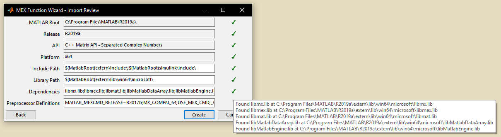
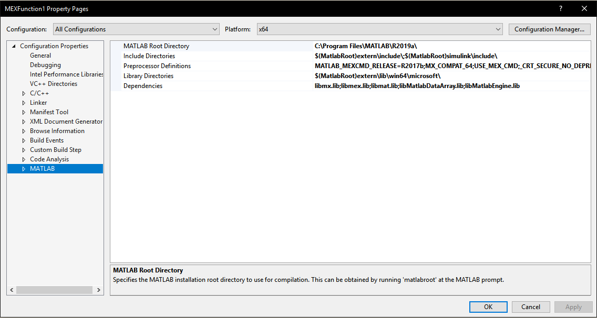

# MEX Function Templates
This is a Visual Studio package which provides project templates for creating MEX functions in Visual Studio. It supports VS2013-VS2019 and can create builds for both 64-bit and 32-bit versions of MATLAB.

## Usage
After installing the extension, a new project template with the name MEX Function should appear in the New Project menu. Enter your project name and press OK to start the project wizard.

In the project wizard you can specify your MATLAB install location and [compilation parameters](https://www.mathworks.com/help/matlab/ref/mex.html) using combinations of the various radio buttons. Also note that you can indeed compile MEX functions for versions of MATLAB which may not have official support for your version of Visual C++.

You can confirm and adjust your selections using the following screen. There are also various checks provided to help you make sure the function will compile with the given settings.

You can also adjust your settings for more configurations after the wizard by editing the MATLAB property page.

After you build the MEX function it will be located in `$(SolutionDir)Bin\$(Platform)\$(Configuration)\` by default. Happy coding!

## License
This project is covered by the MIT license. Refer to `LICENSE` for more information.
